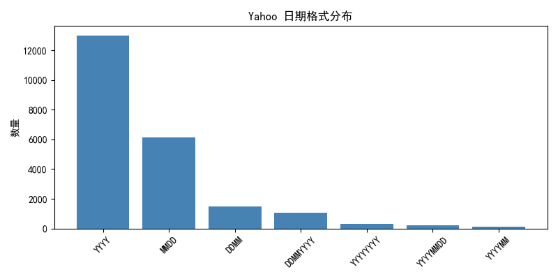
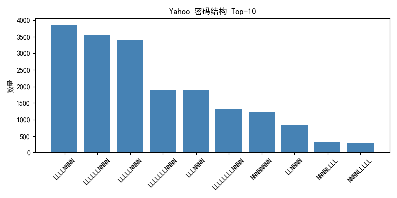
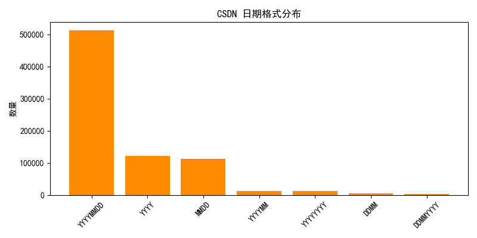
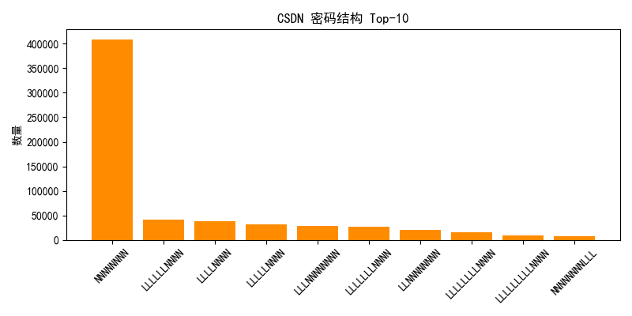
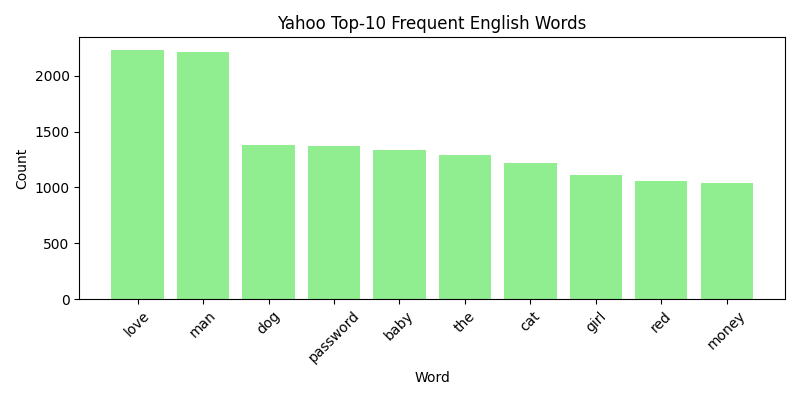
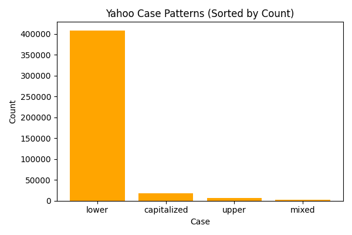
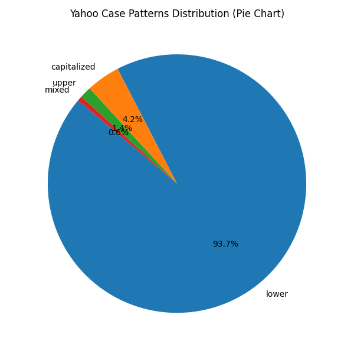
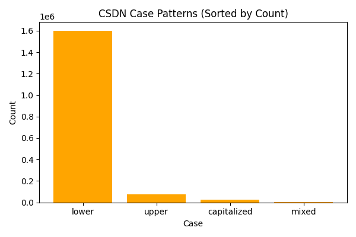

### analy3
> ③ 日期密码及其格式分析，识别日期密码，区分不同的日期格式，日期与其他字符混排的组合方式统计。

#### 代码内容总结

1. 从指定的两个文件（plaintxt_yahoo.txt、www.csdn.net.sql）读取并提取密码，支持Yahoo 和 CSDN 两种行格式。
2. 使用正则表达式识别潜在日期片段，并结合日期验证过滤无效匹配。
3. 将识别出的日期按格式分类，如 YYYYMMDD、MMDD、YYYY、YYYYYYYY 等。
4. 进行密码结构模式建模（N 表示日期，L/S/D 表示其他字符），并生成相应柱状图。
5. 统计各类日期格式频率，并绘制日期格式分布图与高频日期图。
6. 分析高频年份、月日组合，输出完整的文本报告与可视化图表。结果保存到3_date_analysis_result。

---

#### 运行结果

#### Yahoo：
- 密码总数：445,574  
- 含日期密码：22,698（5.09%）

日期格式使用情况以**年份 YYYY** 为主，其次是 **MMDD** 与 **DDMM**。

主要日期格式分布如下：

- YYYY：12,986  
- MMDD：6,423  
- DDMM：1,611  
- DDMMYYYY：1,051  

年份统计显示多数集中于 2000 年代，如 2008、2009、2007 等，说明用户偏向使用近期年份。

高频月日组合包含：

- 1224
- 1225  
- 0117
- 1231

主要体现在节日或特殊日期（0117难以对应为某个特殊日期，但如果出现频次却较高，如果是随机数字串也不符合常理，不妨将其看作特殊日期处理）

在日期与其他字符混排统计中，以结构“字母 + 日期”最突出，如：

- LLLLNNNN（3,970）
- LLLLLLNNNN（3,626）

说明用户偏好短词/单词+日期作为密码主体

也存在部分纯日期类结构，如：

- NNNNNNNN（1,215）

---

#### CSDN 数据集
- 密码总数：6,427,743  
- 含日期密码：777,063（12.09%）

最显著特征是大量完全日期型密码（YYYYMMDD），数量高达：

- YYYYMMDD：512,319  
- YYYY：121,544  
- MMDD：114,674  

年份分布集中在 1980 年代：1987、1988、1989 等，与大部分CSDN用户的出生年代重合，明显反映出生年份依赖。

高频月日组合包含：

- 1001（主要出现在19490808，中华人民共和国正式成立）
- 1225  
- 0808（主要出现在20080808，北京奥运会）  
- 1010

仍然体现为特殊日期的喜好，如节假日或是极具纪念意义的日期

在日期与其他字符混排统计中，以纯日期类结构为主：
- NNNNNNNN（408,961）

---

#### 对比分析

1. **使用率差异**：  
   CSDN的日期使用率（12.09%）明显高于 Yahoo（5.09%）。

2. **年份偏好差异**：  
   Yahoo 的年份偏好偏向近期（2000+），而 CSDN 偏向 1980s（用户出生年代）。

3. **格式结构差异**：  
   CSDN 以完整日期（YYYYMMDD）为主，这种格式通常体现为具体的纪念日期或是出生日期；Yahoo 多为简化年份或非完整日期段并搭配单词。

4. **特殊日期现象**：  
   两数据集均偏好节日或特殊日期，但具体日期与不同的用户群体使用习惯有关。

---

### analy5
> ⑤ 英文单词的使用统计，Top10，大小写等，难点是如何识别。

#### 代码内容总结

1. 从密码中提取全部字母序列，作为潜在的单词候选。
2. 基于 wordfreq 库进行英文单词判断（含频率阈值）。
3. 使用噪声过滤机制排除拼音、键盘序列、重复字符等非英文单词。
4. 统计英文单词使用率、最常见英文词以及大小写模式。
5. 输出图表与完整报告，结果保存到5_english_word_analysis_result。

---

#### 运行结果

#### Yahoo：
- 密码总数：445,574  
- 含英文单词密码：335,726（75.35%）

高频英文单词包括：

- love（2,232）
- man（2,216）
- dog（1,377）
- baby（1,335）
- the（1,291）

大小写模式中：

- 全小写占绝大多数：409,942  
- 首字母大写：18,421  
- 全大写：6,272  
- 混合大小写：2,757  

---

#### CSDN 数据集
- 密码总数：6,427,743  
- 含英文单词密码：1,371,753（21.34%）

高频单词：

- book（57,414）
- love（26,108）
- you（18,968）
- king（6,840）

大小写结构：

- 全小写：1,670,547  
- 全大写：79,542  
- 首字母大写：25,942  
- 混合大小写：6,722  

---

#### 对比分析

1. 英文单词使用率差异显著：Yahoo（75%）远高于 CSDN（21%），反映用户语言结构差异。    
2. 两数据集中全小写占主导，但 CSDN 中全大写比例更高。  
3. 大量使用常见英文单词会降低密码熵，使其更易受字典攻击。

---

### 安全建议
- 避免使用出生年份、节假日日期等高频日期结构。  
- 避免大量使用高频英文单词，必要时加入符号或不可预测字符。  
- 日期、单词、数字类结构应混合使用，提高熵值与抗猜测能力。  
- 避免与个人信息强相关的日期和词汇。
