写在最前面：最后总结实验报告整合的uu请随意删改。

### 数据集处理
点开老师发给我们的两个数据集，可以发现plaintxt_yahoo.txt和www.csdn.net.sql前置都有一些冗余内容。
所以删除一些前置冗余内容，将数据集处理成如下的样子。
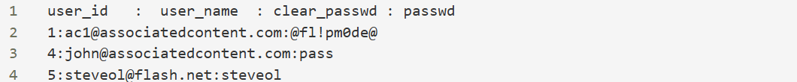
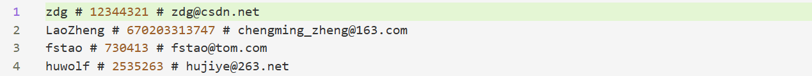

### analy1
> ① 密码构成元素分析（数字、字符、字母等）和结构分析，得到密码中这些基本元素常用的组合方法.
#### 代码内容总结
1. 从指定的两个文件（plaintxt_yahoo.txt、www.csdn.net.sql）读取并提取密码，支持 Yahoo 和 CSDN 两种行格式。
2. 对密码集进行基本统计（条目数、平均长度、字符类型分布）并将结果写入报告文件。
3. 为每个密码生成结构模式（如 LLDD）并统计 Top-N 模式，同时生成相应条形图。
4. 统计高频子串（长度 3–6）的出现次数，并绘制密码长度分布与字符类型占比图表。
5. 对两个文件的密码集合做交叉对比，输出共同高频密码，所有报告与图表保存到 1_analysis_results 目录。

#### 运行结果

Yahoo 密码以字母为主且更倾向短字母串；CSDN 密码大量为纯数字（支付/手机号/验证码样式），且总体更长。两集合存在少量高度集中、全球通用的弱口令（如连续数字/重复字符）。

##### Yahoo（n=442,836）：
平均长度 8.25，字符统计显示小写字母占比最高（72.6%），说明大部分密码以纯字母或字母为主的混合构成。大写仅 2.4%，符号很少（0.49%），提示强度提升的常用字符类很少被采用。
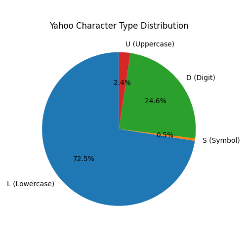
结构上大量为纯字母串（LL…），Top 模式以 6~9 位小写连串为主，出现 LLLLLL、LLLLLLLL 等频次最高，说明用户偏好短词/单词作为密码主体。
高频子串如下所示，
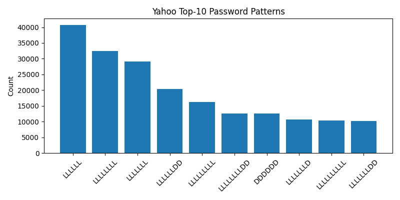
高频子串（如 '123', 'ter', 'and', 'ing'）既包含数字序列，也有常见英文词缀/三字母组合，表明很多密码是由真实词/常用后缀或简单数字串构成（例如 word + digits）。
##### CSDN（n=6,427,743）：
平均长度 9.45，但字符分布极度偏向数字（67.4%），说明大量密码为纯数字（电话号码、身份证、简单数字序列）。大写占比仍低（1.9%），符号少（0.58%）。
下图是CSDN的字符类型
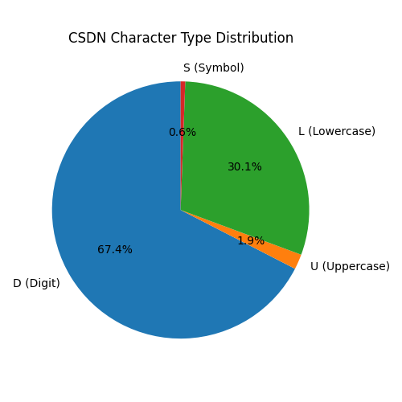

##### 共同点
Top 模式被数字长度占据（DDDDDDDD 等），说明数值型密码在该集更普遍。高频子串以连续数字串（'123','234','456' 等）与重复数字（'111'）为主，反映用户常用可记忆的数列。
跨文件对比：
两文件共有 12,869 个相同密码，Top 共同密码集中在非常常见的弱密码（'123456789','12345678','11111111' 等），且在 CSDN 中占极大次数，表明通用弱密码普遍存在于不同来源数据中。
#### 口令预测
大量纯字母/纯数字与低符号/大写比例直接导致可预测性高，易被基于模板和词表的攻击命中。
高频结构模板（如 LLLLLL、DDDDDDDD）应作为密码强度检测规则重点屏蔽或提示弱口令。
共同高频密码说明存在跨站点重用风险：一旦某站点泄露，攻击者可用同一弱口令在其他站点尝试。

### analy2
>② 键盘密码的模式分析，键盘密码就是基于键位变化的一类密码，比如asdfgh；
#### 代码内容总结
1. 定义并扩展了常见键盘行、列与对角线布局（含大小写/符号扩展）作为匹配字典。
2. 对每个密码检测水平、垂直和对角方向的键盘连续序列（含正向与反向），并统计匹配到的序列。
3. 汇总各类型键盘密码数量、Top-10 序列、出现次数超过100 的序列，并将文本报告写入 2_analysis_results。
4. 生成并保存键盘类型比例图与 Top 序列条形图到输出目录，便于可视化分析结果。

#### 运行结果

##### CSDN
1. 检出键盘模式密码 1,431,344 条，占比 22.27%；水平序列主导（98.14%），垂直与对角序列占比较小（分别约 2.53%、2.34%）。
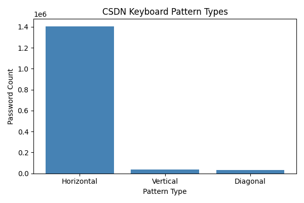
2. Horizontal Top 序列以简单数字序列为主（"123","234","456","345" 等），且这些序列出现次数极高（"123" 出现 1,864,962 次），说明大量密码为数字序列或包含常见数字片段。
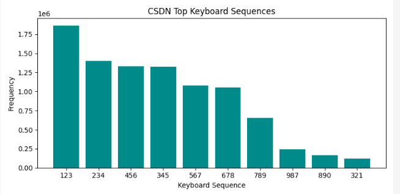
3. Vertical/Diagonal 中出现较多的典型键盘列组合（如 "qaz","wsx","QAZ","WSX"），表明另一部分弱密码使用了同一列的键位滑动或组合。

4. 出现超过 100 次的序列列表显示不仅有数字序列，也有大量字母行序列（如 "qwe","asd","zxc" 及其大小写变体），反映了连续键位经常被作为密码主体。

##### YAHOO
1. Yahoo 检出键盘模式密码 31,593 条，占比 7.13%，显著低于 CSDN，说明 Yahoo 数据集中键盘序列使用频率较低、密码更多为字词或其他结构。

2. Horizontal 仍为主流（95.62%），Top 序列包含数字序列和字母行（"123","234","345","wer","ert" 等）。
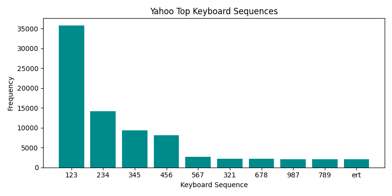
3. 出现超过 100 次的序列中，既有数字序列也有大量字母行序列与其大小写形式，提示对大小写变体的检测对统计结果有影响。

### analy6
#### 代码内容总结
1. 对每个密码计算香农熵（bits/char），并统计平均熵、标准差及低/中/高熵类别比例。
2. 输出 Top-10 熵最高的密码示例并将分析结果写入 6_analysis_results/report_entropy.txt。
3. 生成熵分布直方图和按熵等级的饼图，保存到 6_analysis_results 目录。

#### 运行结果
##### yahoo
平均熵值: 2.674 bits/char，标准差: 0.439
低熵(0~2): 29,086 (6.57%)
中熵(2~4): 413,690 (93.42%)
高熵(>4): 60 (0.01%)
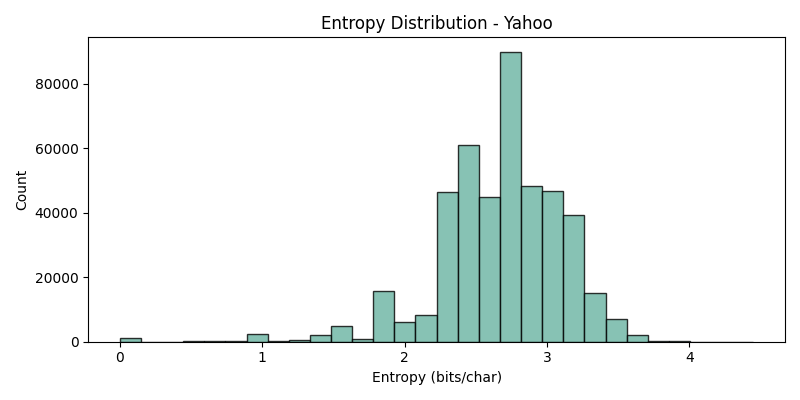
Top 10 熵最高密码（示例）：
  zQbXThY_}}pR,Z%<93s' -> 4.450
  vywmapp7iqmncodylqv5ihusp-_hfr -> 4.348
  abcdefghijklmnopqrst -> 4.322
  nqgST$ipAlJ6Od#fDz9b -> 4.322
  h2Kmn7WGrH4IORsDYbvL -> 4.322
  123456789ABCDEFGHIJK -> 4.322
  PwjeaP64d2mvtpzsqD35 -> 4.222
  fUfzb9C%y*ck\oSM,p.4 -> 4.222
  xV1s%6Wu!lHx^&7B -> 4.222
  JsAU2LI85uyTvxePOmk8 -> 4.222

解读要点（Yahoo）：
- 平均熵处于中等区间（≈2.7），大多数密码（>93%）落在中熵区间，表明普遍含有一定混合性但仍不足以达到高随机性。
- 低熵密码占比 6.6%，这些容易被简单字典/模板快速猜中。
- 高熵密码极少（0.01%），说明强随机密码在样本中很稀缺。

##### csdn
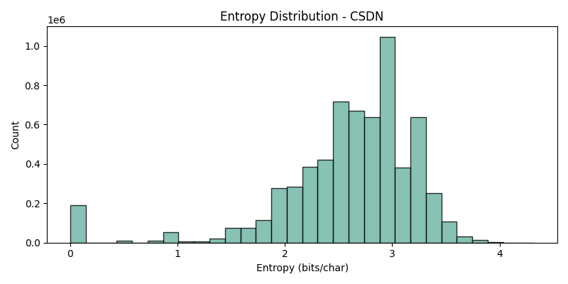
平均熵值: 2.594 bits/char，标准差: 0.664
低熵(0~2): 711,290 (11.07%)
中熵(2~4): 5,715,060 (88.91%)
高熵(>4): 1,393 (0.02%)

Top 10 熵最高密码（示例）：
  qwertyuiopasdfghjklz -> 4.322
  abcdefghijklmn123456 -> 4.322
  qwertyuiop1234567890 -> 4.322
  Q1W2E3R4T5Y6U7I8O9P0 -> 4.322
  1234567890qwertyuiop -> 4.322
  aGT30dFmOgWVkqsIE9No -> 4.322
  nbvcxwmlkjhgfdsqpoiu -> 4.322
  asdfghjklpoiuytrewqv -> 4.322
  （注：部分高熵示例为长且字符多样的组合或键盘全行混合）

解读要点（CSDN）：
- 平均熵略低于 Yahoo（≈2.59），低熵密码比例更高（11.1%），表明 CSDN 数据集中弱密码更多。
- 虽然中熵密码占比高，但真正达到高熵标准的密码仍然极少，易受基于熵/模板的优先猜测影响。

### analy7
#### 代码内容总结

1. 对每条记录检测多种密码与用户名/邮箱的关联规则：完全相等、包含/前后缀、邮箱 local‑part、token 命中、反向以及简单 leet 反替换命中。
2. 按优先级确定主关联类型，统计各类命中数并将相关记录导出为 CSV，同时生成中文报告和关联/非关联饼图保存到 7_analysis_results。
3. 在终端打印分析摘要并返回按类别汇总信息，便于后续筛选、示例查看与基于关联的字典生成。

#### 运行结果
最终得到有11%的密码与用户名或者邮箱相关。
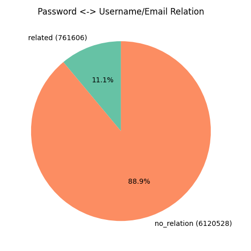