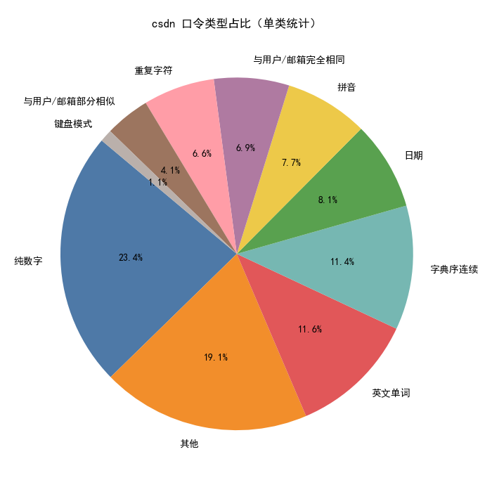
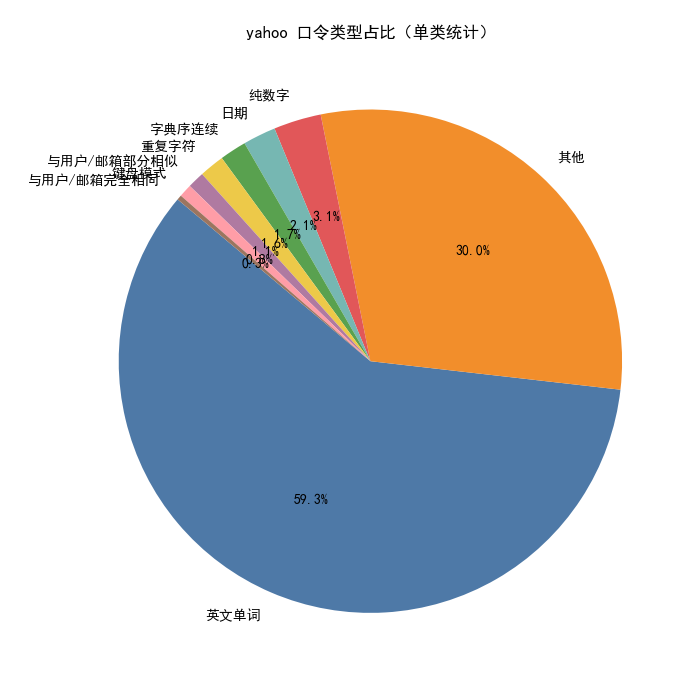
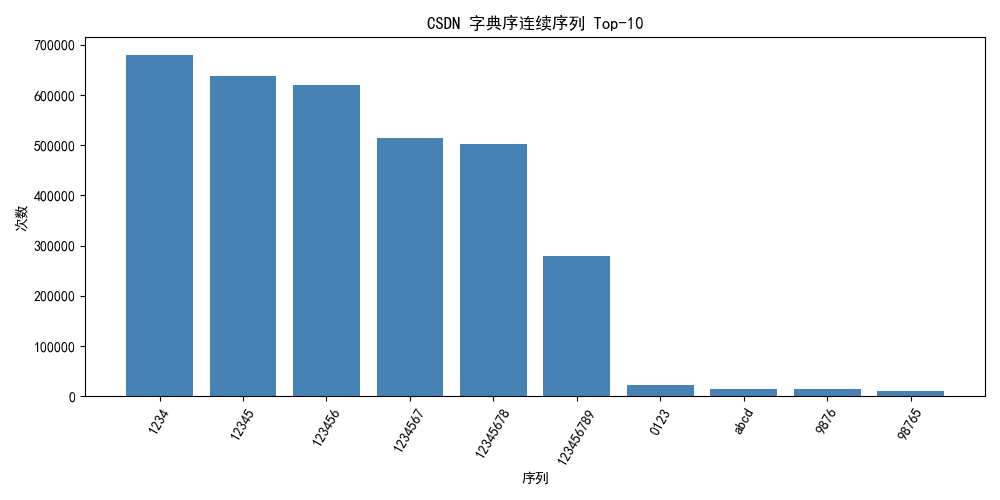
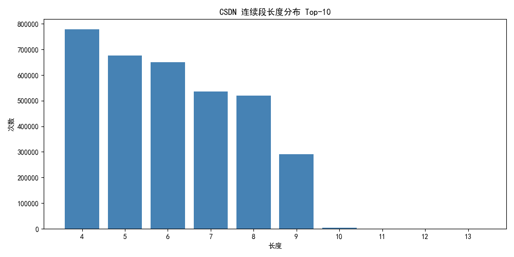
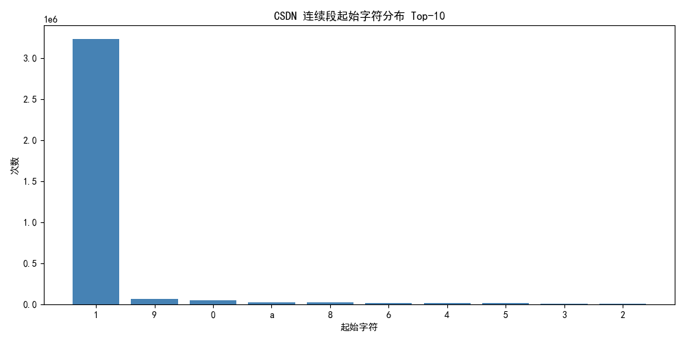
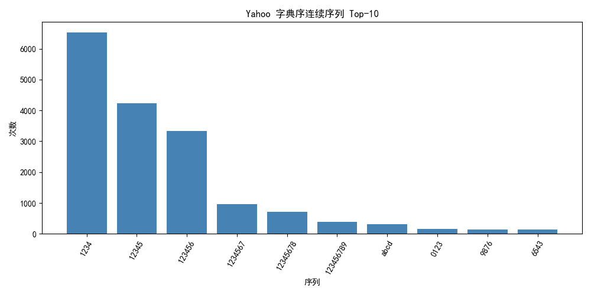
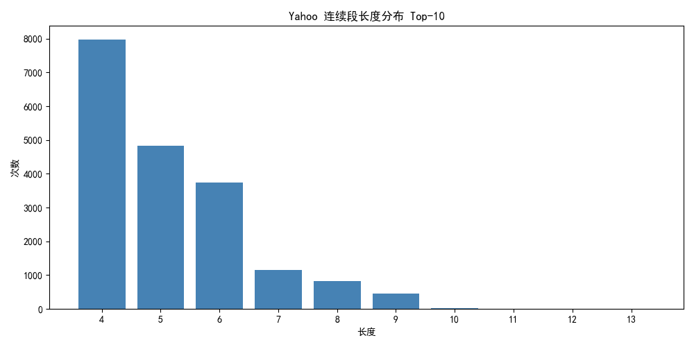
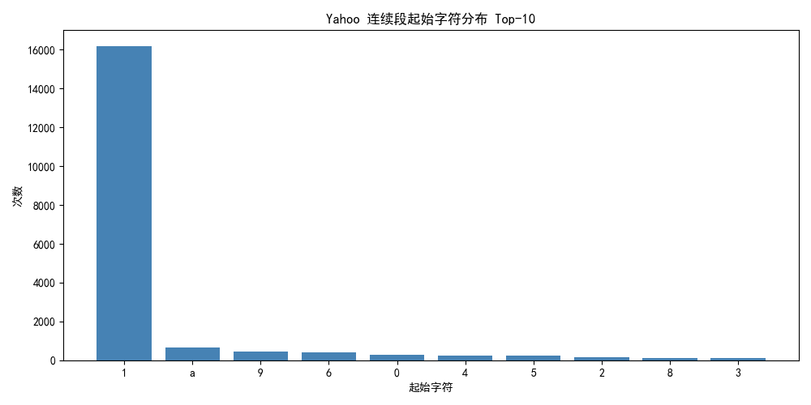

口令类型组成是对analy1的补充，可以合并一下

- analy1：口令类型组成（按分类器统计占比与频次）
- analy8：字典序类口令（连续字符序列，如 123456、abcdef 或其倒序）

---

### analy1-口令类型组成分析

#### 统计方法

- 根据对口令数据集的人工观察，发现最有代表性的口令类型。
- 编写脚本筛选上述类型的口令，将不同类型的口令归类到不同文件中，暂时无法分类的归类到“其他”中。
  - 对分类结果进行人工确认，根据发现的误分/漏分数据，优化口令分类算法。
- 在“其他”类中继续寻找代表性的口令类型，将处理方法加入分类脚本中，重复上述流程。
- 统计时尝试了对多类型复合（如拼音+日期）口令进行分析，但由于分类规则不够精确独立，所得效果有限，汇报中不再展示。

#### 汇总结论
- CSDN（总数 6,414,377）
  - 无明显意义的纯数字占比最高（≈ 23.42%），其次为英文单词（≈ 11.60%）、字典序连续（≈ 11.39%）、日期（≈ 8.14%）、拼音（≈ 7.65%）。
  - 与用户/邮箱相关（完全相同/部分相似）合计 ≈ 10.0%，重复字符（≈ 6.55%）、键盘模式（≈ 1.14%）、其他（≈ 19.12%）。
- Yahoo（总数 442,785，已禁用拼音分类）
  - 英文单词占比极高（≈ 59.30%），其他（≈ 29.97%）。
  - 日期（≈ 2.11%）、字典序连续（≈ 1.72%）、重复字符（≈ 1.61%）、纯数字（≈ 3.06%）、键盘模式（≈ 0.83%）、与用户/邮箱相关（≈ 1.39% 合计）。

#### 主要图表
- CSDN 口令类型占比（饼图）  
  
- Yahoo 口令类型占比（饼图）  
  

解释与安全含义：
- CSDN 中数字、日期、字典序连续与用户/邮箱相关比例较高，显示大量弱口令可被模板化规则快速覆盖。
- Yahoo 英文词显著集中，对此类口令的后续分析需重点加入高频词/词缀/形态变体的规则，并结合数字/日期后缀生成器。

### analy8
> ⑧ 字典序类口令（连续字符序列，如 123456、abcdef 或其倒序）的使用情况与分布。

数据来源：`analysis_results_dictionary_order/summary.json`（来自 `code/analyze/dictionary_order_analysis.py`）。

#### 汇总结论
- CSDN（总数 6,414,377）：字典序口令 ≈ 756,466（占比 ≈ 11.79%）。
  - Top 序列：`1234`、`12345`、`123456`、`1234567`、`12345678`、`123456789` 等。
  - 连续段长度分布以 4~9 为主峰，起始字符以 `1` 绝对占优，其次为 `9/0/a/8/6` 等。
- Yahoo（总数 442,785）：字典序口令 ≈ 7,741（占比 ≈ 1.75%）。
  - Top 序列：`1234`、`12345`、`123456`、`abcd`、`0123`、`9876` 等。
  - 起始字符以 `1` 主导，字母起始集中在 `a`。

#### 主要图表
- CSDN
  - 字典序 Top 序列（柱状图）  
    
  - 连续段长度分布（柱状图）  
    
  - 起始字符分布（柱状图）  
    

- Yahoo
  - 字典序 Top 序列（柱状图）  
    
  - 连续段长度分布（柱状图）  
    
  - 起始字符分布（柱状图）  
    

#### 解释与安全含义
- 字典序连续是最易被穷举与模板命中的弱口令形态，特别是以 `1` 开头的长数字序列。
- 建议在口令策略与检测中直接禁止（或强烈提醒）含有 4 位及以上的连续升/降序片段（含数字/字母）。
