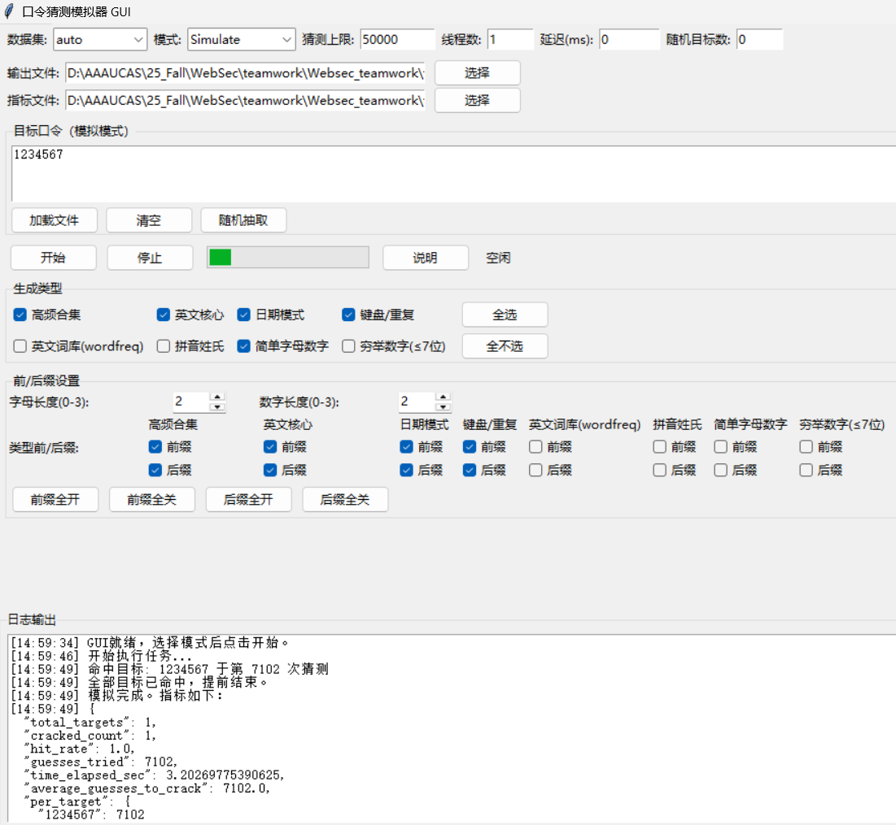
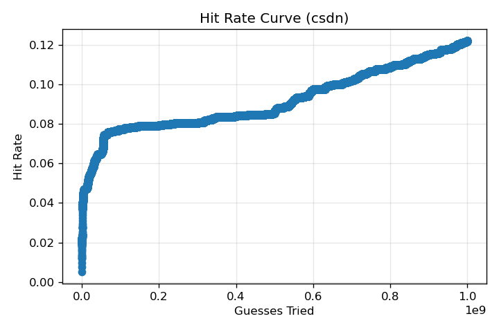
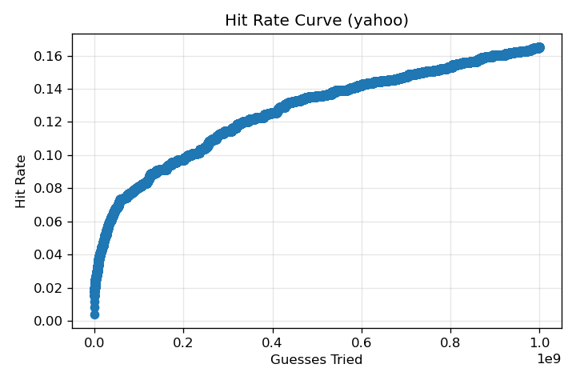

## 任务二 口令猜测脚本与评估报告

本文基于仓库 `task2/guess/` 下的 CLI 与 GUI 实现，对口令猜测思路、脚本各模式功能及 1e9 次猜测评估结果进行说明与分析。

## 口令猜测思路

- 生成策略（纯静态规则，先强后弱，交错输出，跨生成器去重）：
	- 高频合集：项目内汇总的弱口令与常见片段，如 123456、qwerty、abcd、love、money、年份/日期片段等；
	- 英文核心：高频英文词的大小写与简单 leet 变体（a→@、o→0 等），再统一可选前/后缀（字母/数字各 0–3 位）；
	- 日期模式：年份、MMDD、DDMM、YYYYMM、YYYYMMDD 等多种常见格式；
	- 键盘序列与重复串：qwerty、asdfgh、zxcvbn，以及字符按 6–10 次的重复；
	- 英文词库（可选）：如安装 wordfreq 时补充常用英文词原型；
	- 拼音姓氏（可选）：姓氏+常见名音节组合（针对 CSDN 类中文场景有效）；
	- 简单字母/数字组合与重复
	- 数字穷举（≤7 位，含前导 0）。
- 组合与调度：将上述生成器按经验优先级交错（interleave），统一可选前/后缀包装，默认开启跨生成器去重；支持单线程与“分批并行预取”的多线程版本。
- 评估/模拟的数据集角色：仅作为“目标集合”，生成过程不做训练统计，避免数据泄漏；评估输出包含进度采样、命中列表、长度统计与分位数等。

## 脚本与 GUI 模式功能

- 生成（Generate）
	- 目的：只生成候选，日志预览前 100 条，可将全部写出到文件。
	- 关键参数：budget（上限），生成类型选择，前/后缀设置，线程数，输出路径。
- 评估（Evaluate）
	- 目的：在数据集的全部口令（去重后）上，对“前 K 次候选”进行命中率评估。
	- 产物：
		- 指标 JSON：`task2/guess/output/evaluate/eval_metrics_gui_<dataset>_<budget>.json`
		- 命中列表：`task2/guess/output/evaluate/cracked_gui_<dataset>_<budget>.txt`
		- 命中率曲线图：`task2/report/pics/hit_rate_curve_<dataset>_<budget>.png`
- 模拟（Simulate）
	- 目的：针对少量目标（文本框、文件或随机抽样）逐步猜测，记录每个目标首次命中位置与耗时；可设定每次猜测延迟用于演示。
	- 产物：`task2/guess/output/metrics_gui.json` 或自定义路径。
	- Simulate 示例（输入口令 1234567）：

## 评估与有效性分析（各数据集随机抽样 5000 条，1e9 次猜测）

核心指标：
- CSDN：
	- tried = 1,000,000,000
	- total_targets = 4,387（抽样并去重后）
	- cracked = 533
	- 命中率 = 12.15%
	- 命中率-猜测次数曲线图：

- Yahoo：
	- tried = 1,000,000,000
	- total_targets = 4,854（抽样并去重后）
	- cracked = 801
	- 命中率 = 16.50%
    - 命中率-猜测次数曲线图：

### 现象与差异

- 整体：
    - 同样的纯静态生成策略下，Yahoo 的整体命中率（16.5%）明显高于 CSDN（12.15%）。
    - 猜测开始时命中率增长迅速，之后命中率随猜测次数的增长趋于缓慢，但在达到猜测次数上限时仍保持上升趋势。
- 模式匹配：
	- Yahoo 命中列表中，英文字典词（如 password、monkey、flower）、键盘序列（qwerty、asdfgh）、数字序列与年份/日期组合占比高，符合英文社区弱口令分布特性；
	- CSDN 命中中，包含大量中文姓名拼音与数字后缀的组合（如 wang…、chen… 等）以及 YYYYMMDD、MMDD 的日期模式，表明“拼音姓氏 + 数字”与“日期”是重要突破口。
- 长度分布：两者均存在较多 6–10 位的数字/数字+词组合被命中；日期字符串（YYYYMMDD）在两侧均有所贡献（CSDN 更突出）。

### 有效性解读

- 纯静态策略在 1e9 次预算下，已能覆盖并命中典型弱口令与常见派生变体；
- Yahoo 更受英文字典、键盘路径与简单数字后缀影响，因此静态规则能取得更高命中；
- CSDN 受中文命名习惯影响，若加强“拼音姓氏 + 常见名音节 + 有限位前/后缀”的覆盖，命中率预计还能提升。

### 可改进方向

- 针对性扩展：
	- CSDN：扩大拼音姓名词表与名音节组合；增强 YYYYMMDD 与常见分隔符/前后缀的变体密度；
	- Yahoo：引入更丰富的英文字典（如 wordfreq 已集成）与更系统的键盘路径生成；
- 组合调度：对不同生成器的交错比例进行“命中率梯度”调参，使前几十万/几百万次更聚焦高价值候选；
- 性能：
  - 多线程分批预取（已内置）在大预算时可进一步降低等待时间，与更大 budget 配合评估收益曲线。
  - 在工作量很大时，当前脚本运行时的内存占用过大，优化运行时的资源占用，或使用性能更强的设备，可能达到更好结果。

---

以上结果与分析可复现于 GUI 的 Evaluate 模式（选择数据集与预算），曲线图位于 `task2/report/pics/`；Simulate 模式可用于课堂演示弱口令样式（如截图中的 `1234567`）。

